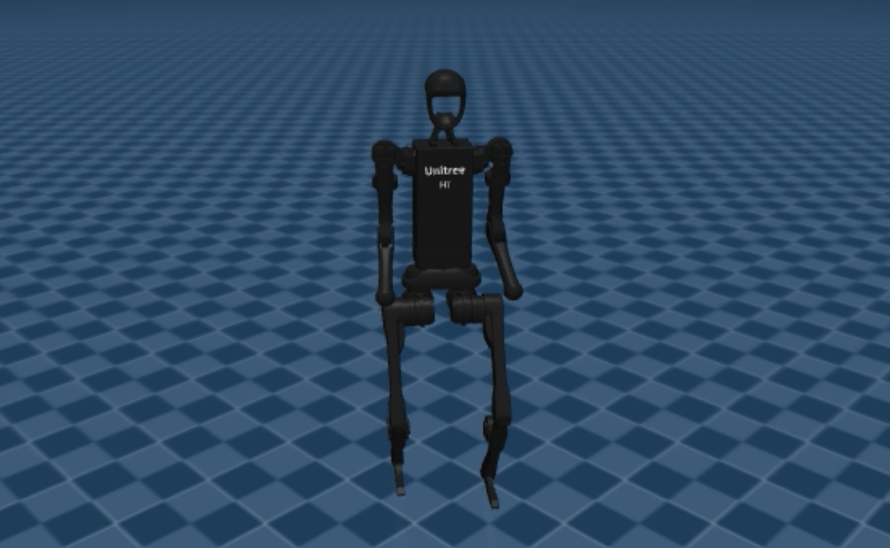

# Unitree H1 Isaac Lab to MuJoCo Sim2Sim

<p align="center">
  
</p>

本仓库整理了基于 [Unitree_RL_LAB](https://github.com/unitreerobotics/unitree_rl_lab) 完成的 H1 机器人 Sim2Sim 迁移部分。核心工作是将 Isaac Lab / RSL-RL 训练得到的 H1 速度追踪策略导出为 ONNX，并在 MuJoCo 中复现策略运行，定位并解决模型坐标轴不一致导致的迁移失败问题。

本项目不是完整训练框架，需要配合 Unitree_RL_LAB 使用。训练、任务环境、策略导出等流程仍在 Unitree_RL_LAB 中完成；本仓库只保留我们完成的 Sim2Sim 迁移脚本、权重、说明文档和验证材料。

## 🎬 Demo Video & Policy Files

The demo video and trained policy files are provided through GitHub Releases instead of being stored in the main repository.

➡️ [Download demo video and policy files](../../releases/tag/V1.0)

### Release Contents

- `sim2sim_vx05_30s.mp4`  
  A 30-second sim-to-sim demo video showing the Unitree H1 humanoid robot performing velocity tracking in simulation.

- `h1-velocity-tracking-policy.zip`  
  The trained policy package used for deployment and sim-to-sim evaluation.

The policy package includes:

```text
deploy.yaml
weight-velocity-track.onnx
weight-velocity-track.pt
</>Markdown

## License

This project follows Apache License 2.0, consistent with Unitree_RL_LAB. Please also follow the licenses of Unitree_RL_LAB, unitree_mujoco, MuJoCo, and related dependencies.

## What We Added

- H1 策略在 MuJoCo 中的独立运行脚本：`scripts/sim2sim_h1.py`
- 68 维观测向量构造，与 Isaac Lab PolicyCfg 对齐
- Isaac Lab 策略关节顺序到 MuJoCo joint / actuator 数组的映射
- ONNXRuntime 策略推理和 PD 力矩控制闭环
- MuJoCo 批量诊断脚本，用于对比 `mujoco_menagerie` 和 `unitree_mujoco` 模型
- 离屏录像脚本和一段已验证视频
- 导出的 H1 velocity tracking 权重和部署参数
- Sim2Sim 迁移过程说明文档

## Repository Layout

```text
.
├── README.md
├── LICENSE
├── requirements.txt
├── scripts/
│   ├── sim2sim_h1.py          # interactive viewer / headless simulation
│   ├── record_sim2sim.py      # offscreen video recording
│   └── diagnose_mujoco.py     # batch diagnostics
├── policies/
│   └── weight-velocity-track/
│       ├── weight-velocity-track.onnx
│       └── deploy.yaml
├── docs/
│   ├── sim2sim_h1_guide.md
│   └── h1_sim2sim_scene_menagerie.xml
└── media/
    └── sim2sim_vx05_30s.mp4
```

## Dependencies

This repository is intended to be used together with Unitree_RL_LAB. Install and verify Unitree_RL_LAB first:

```bash
git clone https://github.com/unitreerobotics/unitree_rl_lab.git
cd unitree_rl_lab
conda activate env_isaaclab
./unitree_rl_lab.sh -i
```

Install Python dependencies for this Sim2Sim package:

```bash
pip install -r requirements.txt
```

The scripts also require the official `unitree_mujoco` assets:

```bash
git clone https://github.com/unitreerobotics/unitree_mujoco
export UNITREE_MUJOCO_DIR=/path/to/unitree_mujoco
```

The expected H1 scene path is:

```text
$UNITREE_MUJOCO_DIR/unitree_robots/h1/scene.xml
```

If `UNITREE_MUJOCO_DIR` is not set, the scripts default to:

```text
/tmp/unitree_mujoco
```

## Run Sim2Sim

Interactive MuJoCo viewer:

```bash
python scripts/sim2sim_h1.py --vx 0.5
```

Headless test:

```bash
python scripts/sim2sim_h1.py --headless --duration 20 --vx 0.5
```

Use explicit scene or policy paths:

```bash
python scripts/sim2sim_h1.py \
  --scene /path/to/unitree_mujoco/unitree_robots/h1/scene.xml \
  --policy policies/weight-velocity-track/weight-velocity-track.onnx \
  --vx 0.5
```

Common commands:

```bash
python scripts/sim2sim_h1.py --vx 0.0
python scripts/sim2sim_h1.py --vx 0.5
python scripts/sim2sim_h1.py --vx 0.5 --vy 0.2
python scripts/sim2sim_h1.py --vx 0.3 --wz 0.4
```

## Record Video

```bash
python scripts/record_sim2sim.py \
  --vx 0.5 \
  --duration 30 \
  --out sim2sim_vx05_30s_new.mp4
```

Relative output paths are saved under `media/`.

## Diagnostics

Run only the verified `unitree_mujoco` H1 policy cases:

```bash
python scripts/diagnose_mujoco.py --duration 15 --scene H
python scripts/diagnose_mujoco.py --duration 15 --scene I
```

Optional menagerie comparison:

```bash
export MUJOCO_MENAGERIE_DIR=/path/to/mujoco_menagerie
python scripts/diagnose_mujoco.py --duration 15
```

## Key Finding

The main migration blocker was not the controller gains or timestep. The decisive issue was the MuJoCo H1 model source:

- `mujoco_menagerie/unitree_h1`: joint axis convention does not match the Isaac Lab USD model, and the policy falls within a few seconds.
- `unitree_mujoco/unitree_robots/h1`: joint convention matches the Isaac Lab model, and the exported policy runs stably.

The implementation also needs to match the Isaac Lab policy interface:

- base angular velocity must be converted from world frame to body frame
- projected gravity, velocity command, joint position, joint velocity, last action, and gait phase form a 68-dimensional observation
- the 19-dimensional policy output is interpreted as joint position offsets
- PD control converts target joint positions into MuJoCo actuator torques

See `docs/sim2sim_h1_guide.md` for the full technical notes.

## Verified Result

The included `weight-velocity-track.onnx` was exported from our H1 velocity-tracking training run. In local validation with `unitree_mujoco`, it stayed upright for 30 seconds or more for commands such as:

| command vx | observed result |
|---|---|
| 0.0 | stable standing |
| 0.3 | stable walking |
| 0.5 | stable walking, sample video included |
| 0.8 | stable walking |
| 1.0 | stable walking with tracking error |

Sample video:

```text
media/sim2sim_vx05_30s.mp4
```

Known limitation: velocity tracking has steady-state error. The observed forward speed is typically lower than the command, indicating the policy still benefits from longer training or domain randomization.

## Relationship to Unitree_RL_LAB

This repository is a focused Sim2Sim migration release built on top of Unitree_RL_LAB:

1. Train and export a policy in Unitree_RL_LAB.
2. Put the exported ONNX policy and deploy parameters under `policies/`.
3. Run the policy in MuJoCo with the scripts in this repository.
4. Use diagnostics and recording scripts to validate the Sim2Sim result.

The full Unitree_RL_LAB training framework and robot assets are not duplicated here.
